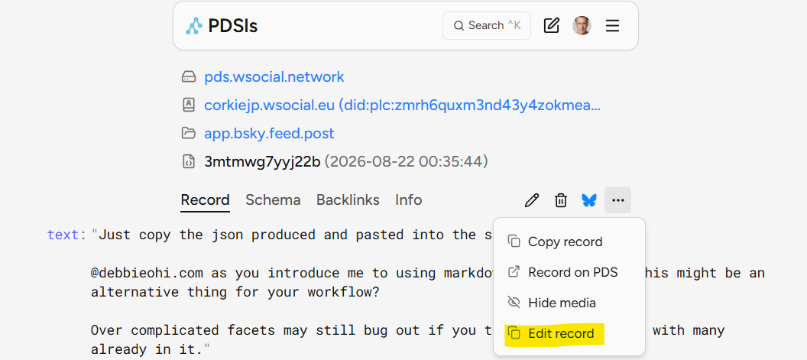
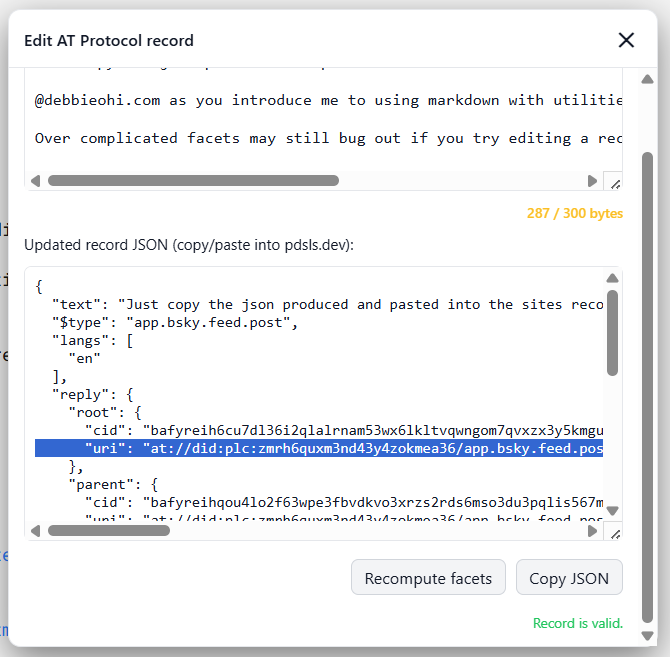

# How use the PDSls editor with the extension.

Above screenshots show the contect button and resulting popup.

## Note

Before editing save your existing record to a text editor incase the process corrupts the record or edits don't result in expected outcomes.

## Getting to specific posts to edit.

Open one of your own post you want to edit in one of the Extension supported clients.

On desktop press the shortcut 'alt+l' and choose the PDSLS.DEV option. Login if you haven't already. Repeat the same process if you are not, if needed.

Mobile at the time of drafting this haven't tested, but probably very hard to edit on that.

## Editing process

Use the top text box to edit the content of the post. You can craft markdown links in the box as well.

Hit the recompute button and it will provide feedback if the json is valid. You may exceed the posts limits with markdown, but once it is converted should be valid as a result.

Hit the copy json button and paste over the record with the sites editor.

## Un expected outcomes

Complicated records with existing facets may not update nicely, you did take a backup? Overwrite the record with it and edit the created at date so it does not give warning for old posts.

## Creating brand new posts

Pdsls lets you create a post record, create on and follow the same process of editing the record.
