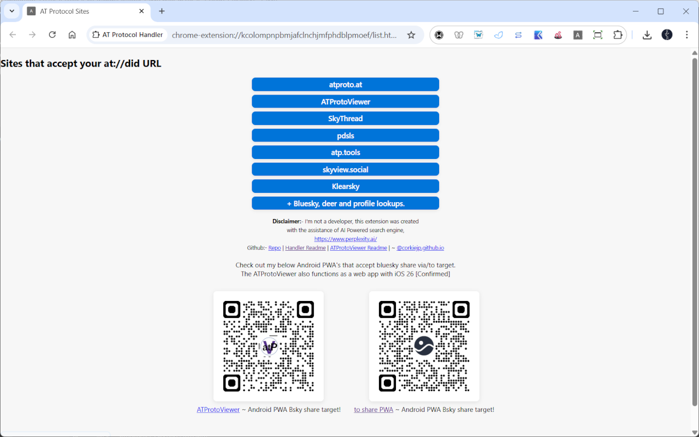

## AT Protocol Handler ~ Chrome extension to open at did urls
POC/WIP Manual extension install only at present.
Resolves to the below sites in image at present.
Use: - 'at' as the keyword to put in the browser url, press space/tab to activate and then paste url!

[Live example output with 'aturl' parameter passed to it](https://corkiejp.github.io/ATProtocolHandler/list.html?aturl=at://did:plc:vovinwhtulbsx4mwfw26r5ni/app.bsky.feed.post/3lssubf2d6b2c)

This is a quick temporary readme!

To install take the four files in this folder background.js, list.html, list.js and manifest.json. Then place them in a folder on your computer, and load unpack with 'chrome://extensions/'.
You can also manage your own set of links by making similar additions to list.js.

Or alternatively download the .src file, un zip it to a folder, then unpack it.

Proof of concept and possibly a work in progress, If I find more utilise that accept an at url as a parameter, I may add more links.

If you know of others please share? Manual install only at present, waiting on chrome webstore to approve my extension.
