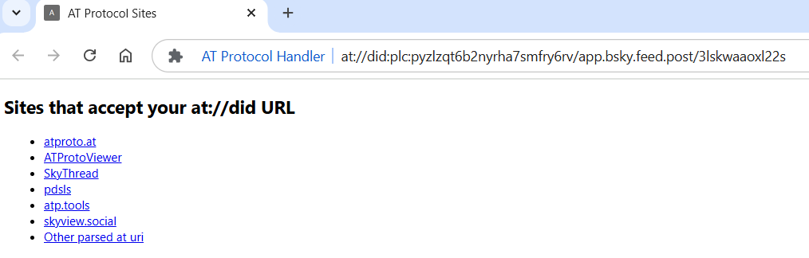

## AT Protocol Handler ~ Chrome extension to open at did urls
POC/WIP Manual extension install only at present.
Resolves to the below sites in image at present.
Use: - 'at' as the keyword to put in the browser url, press space/tab to activate and then paste url!

This is a quick temporary readme!

To install take the four files in this folder background.js, list.html, list.js and manifest.json. Then place them in a folder on your computer, and load unpack with 'chrome://extensions/'.

Proof of concept and possibly a work in progress, If I find more utitise that accept an at url as a parameter! If you know of others please share? Manual install because unless I get allot more utilities, it is not worth yet submitting to the webstore.

